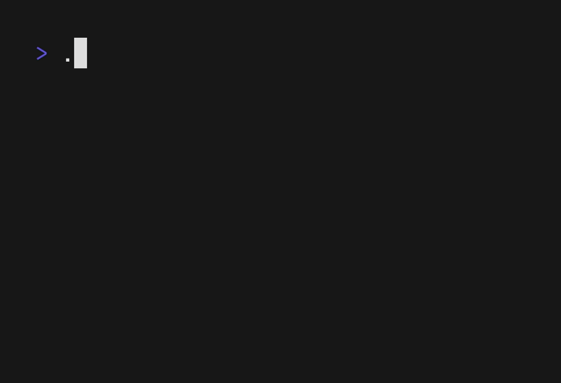

# bunbun
A simple and adorable sysinfo utility.

<p align="center">
  
</p>

## Installation
To build `bunbun`, you'll need [Rust](https://rust-lang.org) installed:
```bash
$ git clone https://git.devraza.giize.com/devraza/bunbun
$ cd bunbun
$ cargo build --release # `--release` adds a few optimisations
```

This will make a binary in `target/release` with the name `bunbun`. To use this as you would any other program, add it to a directory on your `$PATH`, such as `/usr/local/bin` or `$HOME/.local/bin`.

### NixOS
`bunbun` is now packaged on NixOS/nixpkgs, maintained by [GaetanLepage](https://github.com/GaetanLepage)! If you have Nix installed, you can try it with:
```bash
nix-shell -p bunbun
```
To install it on NixOS or home-manager, add `bunbun` to `environment.systemPackages` or `home.packages` respectively.

## Platform support
`bunbun` primarily supports Linux; NixOS particularly. Secondary support is available for MacOS which I sometimes test on. Windows has the least support, but should be expected to largely work.

> **Note** Should you encounter any problems, please do let me know! Either with an [issue](https://github.com/devraza/bunbun/issues/new) here on GitHub or via [e-mail](mailto:devraza.hazard643@slmail.me).

## Inspiration
- [Rosettea/bunnyfetch](https://github.com/Rosettea/bunnyfetch)
- [elenapan's `bunnyfetch` script](https://github.com/elenapan/dotfiles/blob/master/bin/bunnyfetch)

## License
This project is covered by the [Mozilla Public License 2.0](./LICENSE.md).
